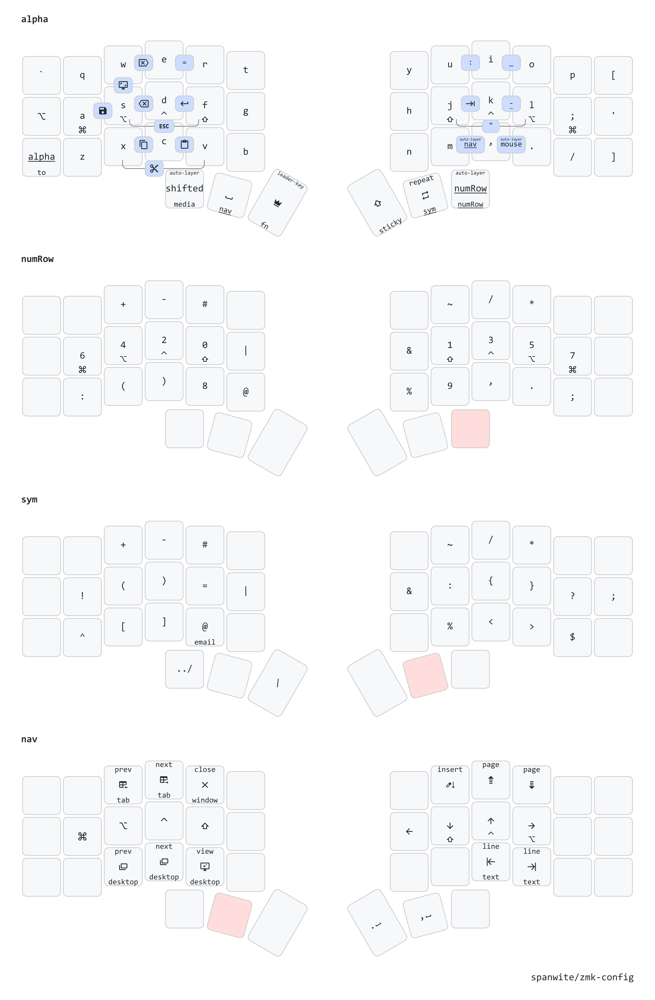

# zmk-workspace

This repository is a workspace for building ZMK firmware, based on [urob's zmk-config](https://github.com/urob/zmk-config)

Difference from urob's zmk-config:

- Advanced draw configuration (inspired by [rafaelromao](https://github.com/rafaelromao/keyboards))
- Personal zmk configuration divided into multiple files. Main keymap is located in `config/keymap` directory

## Keymap

The image above shows just the most relevant layers. You can see the full diagram [here](draw/png/all.png).

## Local build environment

See [urob's zmk-config readme](https://github.com/urob/zmk-config?tab=readme-ov-file#local-build-environment) for Nix and direnv setup.
